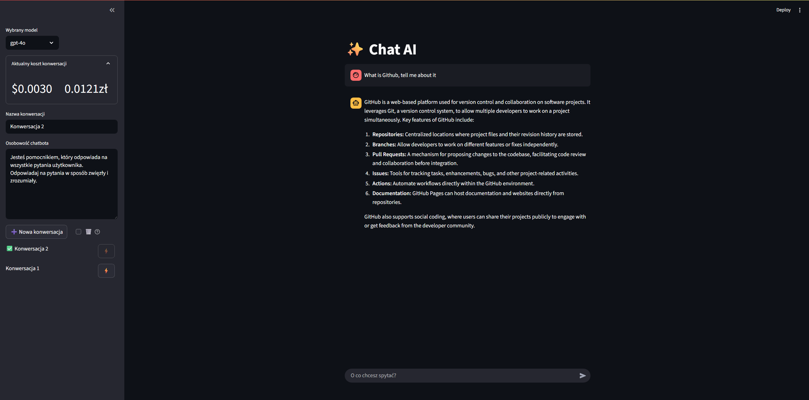

# ✨ Chat AI

## 📋 O projekcie

Nowoczesna aplikacja czatu z AI zbudowana w Streamlit, która umożliwia prowadzenie rozmów z modelami OpenAI (GPT-4o, GPT-4o-mini) z pełnym zarządzaniem konwersacjami i monitorowaniem kosztów.


## 📱 Demo



## 📁 Struktura projektu

```
chat-ai/
├── app.py                 
├── requirements.txt       
├── .env.example          
├── README.md             
├── others/               
└── db/                   
    ├── current.json      
    └── conversations/    
        ├── 1.json       
        ├── 2.json       
        └── ...          
```
## ⚙️ Technologie
---

* **Frontend/Backend**: Python, Streamlit
* **AI Integration**: OpenAI API (GPT-4o and GPT-4o-mini models)
* **Monitoring**: Langfuse (API call observation)
* **Data Management**: JSON (conversation storage)
* **Configuration Management**: Python-dotenv
* **File Handling**: Pathlib

## 🛠️ Instalacja
---

   ```bash
   #Sklonuj repozytorium*
   git clone https://github.com/skwarlinski/Chat-AI.git
   cd chat-ai
   
   #Zainstaluj zależności
   pip install -r requirements.txt
   
   #Skonfiguruj zmienne środowiskowe
   cp .env.example .env
   #Edytuj plik .env i dodaj swoje klucze
   
   #Uruchom aplikację
   streamlit run app.py
   ```

## 🧠 Podejście i rozwiązania techniczne

Projekt implementuje kompleksowe podejście do tworzenia aplikacji konwersacyjnej:

1. **Integracja z OpenAI API** - połączenie z API OpenAI do generowania odpowiedzi z użyciem dekoratora `@observe()` z Langfuse do monitorowania.

2. **System pamięci konwersacji** - zarządzanie historią rozmów przy jednoczesnym zachowaniu kontekstu dla modelu AI.

3. **Zarządzanie konwersacjami** - tworzenie, zapisywanie i przełączanie między wieloma konwersacjami przy użyciu lokalnego systemu plików i formatu JSON.

4. **Personalizacja AI** - możliwość dostosowania osobowości chatbota poprzez edycję systemowego prompta.

5. **Monitorowanie kosztów** - obliczanie kosztów w czasie rzeczywistym na podstawie użytych tokenów wejściowych i wyjściowych.

## 📬 Kontakt

Masz pytania lub sugestie? Odezwij się!

- 💼 [LinkedIn](https://www.linkedin.com/in/hubert-skwarlinski-895437368/)
- 💻 [GitHub](https://github.com/skwarlinski)
- ✉️ Email: [skwarlinskihubert@gmail.com](mailto:skwarlinskihubert@gmail.com)

## 📜 Licencja

Projekt dostępny na licencji **MIT** – możesz używać, kopiować i rozwijać aplikację na własne potrzeby.